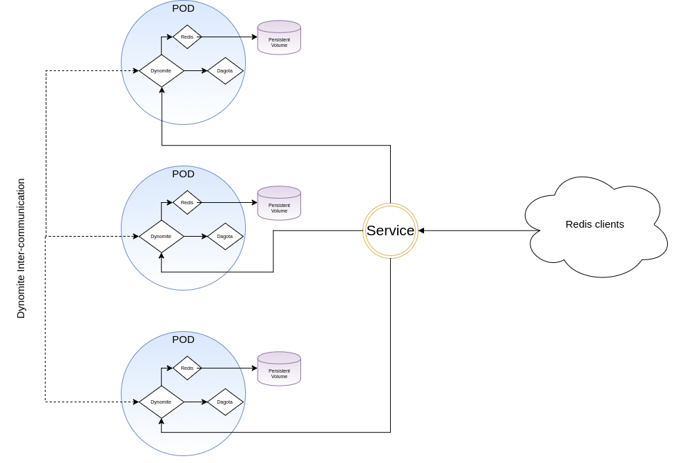

# Dagota -  High Available Redis for Kubernetes and OpenShift via Netflix/Dynomite

OpenShift and Kubernetes becomes central occupation for serveral of our projects. Redis, in a another habd, is an useful tool we have to integrate in our solutions. After a while using sentinels and having troubles with some framework to connect them, we decided to use "dynomite" and build a tool named "dagota" to make Redis High Available in OpenShift/Kubernetes without any pain.

## The state of the problem

Redis is built to be high available. Yes, it is. But it needs something *special*: sentinels (https://redis.io/topics/sentinel)

Sentinels are slaves that *can* be master as soon as the master is down. When a sentinel is down, another takes that place. That's very useful and it can works for clients that knows how to get new master address to write.

Sentinels makes monotoring of other sentinel, master and slaves.

Because that's how it works. Sentinels are all "read-only" excepting one which has the master role. To be able to write new key, you must call sentinel where is the master, and then use it to send keys/values.

If the client is able to use that request, it's ok. But what if it's not the case ? We unfortunately had that case...

And another thing to appreciate is that OpenShift and Kubernetes also makes monitoring of the pods. So when a Redis falls, Kubernetes recreate a new one... "Services" are made to load balance, so a client should not "find sentinel", it only must contact the "service" and nothing more.

So the other solution was to have *multi-master* installation. But... Redis is not able to share database for several master.

We tried a lot, we checked, tested, and finally we find Dynomite (thanks to Laurent Andraud, coworker at Smile)

## Dynomite, the power from Netflix

Netflix makes use of Redis and we can be sure that they had scalability problematics to resolve. Thousand of servers to connect, and for sure, they won't have sentinels resolution to do. 

Based on a whitepaper named [Dynamo]( http://www.allthingsdistributed.com/files/amazon-dynamo-sosp2007.pdf) they built "Dynomite":
https://github.com/Netflix/dynomite

That project is OpenSource, congratulations to Netflix to share that work so that we can make the same with our solution based on Dynomite.

A very nice blogpost can be consulted here: https://medium.com/netflix-techblog/introducing-dynomite-making-non-distributed-databases-distributed-c7bce3d89404

Dynomite is a master replication for high availablity servers as Redis and Memcached.


That works like a charm and it's really very efficient. But we had to resolve some problems to make it working on OpenShift. We have to detect our peers to reconfigure Dynomite so it can be able to add that "seeds" to the quorum.

## Peer-finder, and the refresh problem

Peer-finder was the way we followed. That little tool, built with Golang, returns every "peers" that is in a Statefulset. On change, we can call a bash-script to do some stuffs.

There are 2 problems:

- rewrite configuration will not refresh Dynomite, so we needed to kill and restart the process, and that's not ok for us
- we needed to have 2 process in one container: one to launch dynomite, one other to launch peer-finder

But dynomite gives a nice system to adapt seed list. It is named "florida" and it is very simple to adapta. 

Instead of giving the seed list in configuration, we can give a "provider" name. Florida is an HTTP Server built in NodeJS that returns a seed list. But that list is a file, only rewitten in a certain format adapted to Dynomite.

## Dagota, merge of florida and peer-finder

Our solution is very simple:

- use peer-finder like program that detect peers
- serve that list as florida does

We've written that program in Go (to not have some dependencies and to directly adapt peer-finder source code) and built **Dagota** (as Dakota).

When we create the statefulset, dagota container searches peers and serve the list as Florida did.

Our Dynomite container hits Dagota to get list.

And finally, we added a redis server as container that dynomite can contact.

The whole containers are embeded in a Pod, so every containers uses "localhost" or 127.0.0.1 address to contact each other. And the job is made !





Boths images are opensources, the project is on Github:
- https://github.com/smile-sa/dagota

And images are on docker hub:
- https://hub.docker.com/r/smilelab/dynomite
- https://hub.docker.com/r/smilelab/dagota

You can use our examples (persistent and ephemeral) that are provided in our Github repository.


If you want to give a try, in OpenShift:
```
oc create -f https://raw.githubusercontent.com/Smile-SA/dagota/master/dynomite.statefulset.persistent.yml
# or, without storage
oc create -f https://raw.githubusercontent.com/Smile-SA/dagota/master/dynomite.statefulset.yml
```

That should work on Kubernetes the same way, using "`kubectl`" instead of "`oc`".

## What's next

At this time, the source code for Dagota is not very clean. It works, manage errors and is not buggy as far as we know. But we want to make it more readable and sure.

The statefulset is ok but we really want to find ways to make it working as Deployment or DeploymentConfig. There are possibilities to use API but that needs to create service account and given them read policy. Even if it's not so complicated, it is not usable in a Template without client manipulation before to process it.

Statefulset cannot use ImageStream, it's a Kubernetes object that is not overriden by OpenShift. And that's a problem if you want to build your own Dagota image. The Statefulset will need your ImageStream address and you cannot trigger rolling updates.

A last problem is that we wanted to use centos/redis-32-centos7 image but a weird behavior happends. We can connect and use redis-cli as a shell, but we cannot send command in one line.

Example:

```bash
$ redis-cli -h dynomite
> set foo "bar"
OK

# then
$ redis-cli -h dynomite get foo
Server disconnect

# but:
$ redis-cli -h dynomite
> get foo
"bar"
```

That behavior doesn't happend if we use the official "redis" from dockerhub, so at this time we are using that one.


And last but not least, why not use the rack and datacenter capabilities of Dynomite to split redis in serveral Statefulsets that use nodeAffinity on large Kubernetes or OpenShift plateform ? Maybe later, if you want to help we will be happy to check your propositions !

